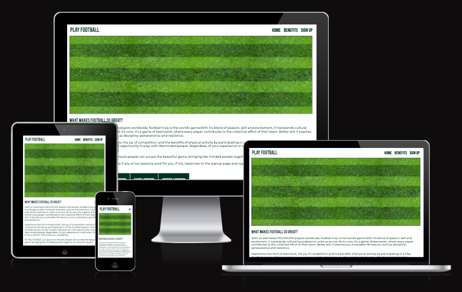

# Play Football

The website was created to give people across London the possibility to participate in football sessions. It aims to create a sense of community and encourage people of all abilities to play the beautiful game.

The site contains a home page with three sections, a benefits page outlining some of the many reasons to participate and a contact page that allows visitors to sign up and receive alerts about new sessions in their area.

A live version of the project can be found here - https://danfnkd.github.io/playfootball/

# Table of Content

+ UX
    + User Demographic
    + New Users
    + User Goals
    + Requirements
    + Design
        + Colors
        + Typography
        + Images
+ Features
    + Existing Features
        + Header Section with Logo and Navigation Bar
        + Home Page Image
        + Home Page Section
        + Benefits Page Image
        + Benefits Page Section
        + Signup Page Image
        + Signup Page Section
        + Footer Section
+ Technologies Used
+ Testing
    + Validator Testing
    + Unfixed Bugs
+ Deployment
+ Content
+ Media
+ Credits

## UX

### User Demographic

This website was created for:

- People that played Football in their youth and want to reconnect with the sport.
- People that have never played Football before and want to start doing so.
- People that want to learn more about the sport's benefits.

### New Users

- As a new user I want to learn more about where I can play Football in the London area
- As a new user I want to be motivated to start/resume playing

### User Goals

- Find out about Play Football sessions
- Understand more about Football
- Understand more about the physical and mental benefits of playing
- Join a likeminded community
- Receive updates on new sessions that are easier/more convenient for me to attend 

### Requirements

A static responsive website that incorporates the technologies that I have learned so far containing some of the more advanced functionality. The development process needs to be well documented through a version control system such as GitHub.

Required technologies: HTML & CSS

### Design

As this was my first project, the design has been influence by the "Love Running" project as well as my past experience with website design.

My objective was to create a site that was minimalistic, clean and had high readability. There isn't a targetted demographic therefore ensuring that the website felt agnostic was key.

The Play Football website is divided into three sections: header, body and footer. The navigation in the header uses an icon from 768 pixels and down.

#### Colors

There are two colors used throughout the website, white (#ffffff) and dark green (#023020). The green was inspired by the color of a football pitch and using a dark shade increased user readability.

#### Typography

The Google Font Bebas Neue (https://fonts.google.com/specimen/Bebas+Neue?query=bebas+neue) was chosen as the font for the header elements with a fallback of Sans-Serif.

The Google Font Montserrat (https://fonts.google.com/specimen/Montserrat?query=montserrat) was chosen as the font for paragraph elements with a fallback font of Sans-Serif.

#### Images

Images have been chosen in accordance with the color and content. The purpose of the website is to inspire and motivate.

## Features

The Play Football webste is a three-age website consisting of the following sections:

- Header Section (Logo & Navigation Bar)
- Home Page Image
- Home Page Section
- Benefits Page Image
- Benefits Page Section
- Signup Page Image
- Signup Page Section
- Footer Section

### Existing Features

#### Header Section with Logo and Navigation Bar

- The Header consists of of the text "Play Football" aligned to the left and a Navigation Bar which is aligned to the right.
- Featured on all three pages, the Navigation Bar includes links to the Home Page, Benefits Page and Signup Page.
- The Header is designed responsively across device types.

#### Home Page Image

- The Home Page Image was selected to show that Football can be enjoyed by simply stepping foot on a grass surface. The image is isolated and conveys the feeling that many people wanting to participate but not knowing how may be feeling.

#### Home Page Section

- The opening provides an introduction to the sport of Football, highlighting the sheer scale of its popularity and the reasons for participation.
- It then links to the main objective of the site, encouraging people to participate in a session or sign up to join the community.
- A table is included to provide an overview of the existing sessions available at Play Football and is designed responsively for mobile devices.

#### Benefits Page Image

- The image shows a large number of fans attending a Football match. This compliments the content on the page which highlights the mental benefits of participation alongside the physical ones. It aims to continue the theme of scale referenced on the Home Page.

#### Benefits Page Section

- The core content on the page outlines the benefits of playing Football, both physical and mental.
- Font Awesome icons are used to break up the text.
- An inspirational video showcasing some emotive moments in Football was included to further entice people to participate.
- The Youtube video is responsive and doesn't autoplay on any browser.

#### Signup Page Image

- The final image merges the concepts from the preceeding two images, showcasing people playing football on a grass surface surrounded by likeminded people in a social setting.

#### Sign Up Page Section

- Text included to serve as a call to action and encourage people to submit their data into the form.
- Form designed to grab attention and increase sign up likelihood.
- Each individual field was tested as well as a completed submission.

[Signup Form Validation](./assets.readme-images/signupvalidationcomplete.png)

#### Footer Section

- Footer links to X, Facebook, Youtube & Instagram included and validated.

## Technologies Used

- HTML
- CSS

## Testing

Testing was conducted using Google Chrome and Safari (laptop and mobile). Testing different devices and screen resolutions was completed via Google DevTools.

Main issues discovered:

1. Initial Home Page image was blurry.
- Replaced with a higher resolution image.
2. Youtube video was autoplaying.
- Added code to stop this behaviour.
3. Menu not working properly on smaller screens.
- Added a football icon to be used on smaller screens and be consistent with the design.
4. GitHub bug that prevented me from loading project with GitHub pages.
- Contacted Code Institute Tutor Support for troubleshooting. Initially tried to manually remove code from the page but that didn't work. Code was copied across to a new repository resolving the issue.

### Validator Testing

- HTML
    - No errors were returned when the code was passed through the official W3C Validator.
- CSS
    - No errors were returned when the code passed through the official Jigsaw Validator.

### Unfixed Bugs

- All of the bugs were fixed and added to the Testing section.

## Deployment

CodeAnywhere and GitPod were used as the IDE's for this project. Regular commits and pushes to GitHub were made for version control and to track development.

The live version of the project was deployed to GitHub pages.

Deployment process:

1. Log into GitHub
2. Find and load relevant GitHub repository
3. Select "Settings"
4. Click "Pages" in the Code and automation section
5. Select "Main" as the branch and "/root" as the folder
6. Click "Save"
7. The "github-pages" link is now visible in the "Deployments" section on the repository

A live version of the project can be found here - https://danfnkd.github.io/playfootball/

## Content

- Text for the benefits of Football was taken from:
    - https://footballflick.com/blogs/news/how-football-can-improve-you-mental-health 
    - https://www.pushdoctor.co.uk/exercise/the-health-benefits-of-playing-football 
- Certain aspects of the design were inspired by the "Love Running" project, including the Table on Page 1 and the Footer.
- The icons in the benefits section and footer section were taken from Font Awesome - https://fontawesome.com/

## Media

- All of the images used in the project were taken from Pexels - https://www.pexels.com/

## Credits

Martina Terlevic
    - My Code Institute Mentor, thank you for your help with design and time management!

Sean and Roo
    - Tutors that helped me through the anomalous GitHub Pages issue!

